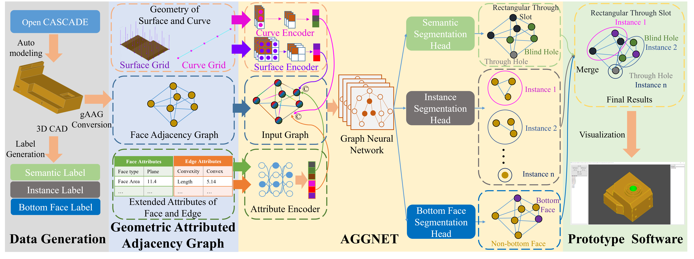
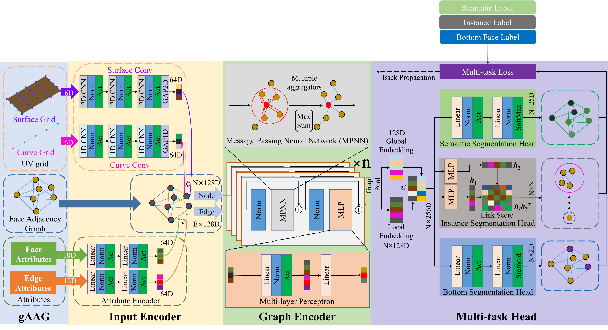

# AAGNET: A Graph Neural Network towards Multi-task Machining Feature Recognition

This repository provides an implementation of AAGNET described in the paper: [A Graph Neural Network towards Multi-task Machining Feature Recognition](https://doi.org/10.1016/j.rcim.2023.102661).

## Abstract
Machining feature recognition (MFR) is an essential step in computer-aided process planning (CAPP) that infers manufacturing semantics from the geometric entities in CAD models. Traditional rule-based MFR methods struggle to handle intersecting features due to the complexity of representing their variable topological structures. This motivates the development of deep-learning-based methods, which can learn from data and overcome the limitations of rule-based methods. However, some existing deep learning methods compromise geometric and topological information when using certain representations such as voxel or point cloud. To address these challenges, we propose a novel graph neural network, named AAGNet, for automatic feature recognition using a geometric Attributed Adjacency Graph (gAAG) representation that preserves topological, geometric, and extended attributes from neutral boundary representation (B-Rep) models. Furthermore, some existing methods (such as UV-Net, Hierarchical CADNet) lack the capability of machining feature instance segmentation, which is a sub-task of feature recognition that requires the network to identify different machining features and the B-Rep face entities that constitute them, and it is a crucial task for subsequent process planning. AAGNet is designed as a multi-task network that can perform semantic segmentation, instance segmentation, and bottom face segmentation simultaneously for recognizing machining features, the faces associated with those features, and their bottom faces. The AAGNet is evaluated on various open-source datasets, including MFCAD, MFCAD++, and the newly introduced MFInstSeg dataset with over 60,000 STEP files and machining feature instance labels. The experimental results demonstrate that AAGNet outperforms other state-of-the-art methods in terms of accuracy and complexity, showing its potential as a flexible solution for MFR in CAPP.



This paper proposes a novel GNN model, named AAGNet, which is designed to perform multi-task machining feature recognition using topological, geometric, and extended attributes from neutral B-Rep models. AAGNet comprises three main components: an input encoder, a graph encoder, and a multi-task head, as depicted below. 



## Requirements
Anaconda and Miniconda are recommended.

You can prepare the environment by 
```
conda env create -f environment.yml -n pyocc(your env name)
```

Or you can install the following packages by yourself:
- python=3.10
- [pytorch](https://pytorch.org/get-started/locally/)
- [DGL](https://docs.dgl.ai/)
- scipy
- numpy
- [numba](https://numba.readthedocs.io/en/stable/)
- h5py
- [pythonocc-core=7.5.1](https://github.com/tpaviot/pythonocc-core)
- occt=7.5.1
- scikit-learn
- [timm](https://github.com/huggingface/pytorch-image-models)
- [wandb](https://github.com/wandb/wandb) (optional)
- [torchmetrics](https://github.com/Lightning-AI/torchmetrics)
- [torch-ema](https://github.com/fadel/pytorch_ema)
- [tqdm](https://github.com/tqdm/tqdm)
- [occwl](https://github.com/AutodeskAILab/occwl) (you can directly pip setup.py install from this repo, rather than conda)

## Dataset
- **MFCAD** with gAAG: https://aistudio.baidu.com/aistudio/datasetdetail/207373?lang=en.
- **MFCAD++** with gAAG: https://aistudio.baidu.com/aistudio/datasetdetail/207819?lang=en. (Note that since some STEP models in MFCAD++ have some topological errors, we performed data cleaning to obtain a better quality training set. Therefore, the number of our training, validation and testing samples is slightly smaller than the original MFCAD++, but the impact on the experimental results is negligible.)
- **MFInstSeg**: https://aistudio.baidu.com/aistudio/datasetdetail/211864?lang=en (Google Drive: https://drive.google.com/file/d/1T2sHlL-4qlsXTxu3AMBB4h-N1I5VqNky/view).

## Data Generation & Conversion
If you just train/test/visualize on MFCAD/MFCAD++/MFInstSeg dataset, skip this.
If you want to build your own dataset and learn more about how we create the MFInstSeg dataset, you can see [Machining Feature Instance Segmentation Dataset](dataset/README.md).

## Training
1. Make sure you have prepared required environment.
2. Download the dataset with gAAG.
3. Unzip the dataset to the place you like
4. Pull the AAGNET code.

### Train on MFCAD/MFCAD++
Make sure you have downloaded the MFCAD/MFCAD++ dataset with gAAG.
Open [engine\seg_trainer.py](engine/seg_trainer.py), you can modify the training code and config in this file. 
```
Line 27 dataset_name = "MFCAD2" # option: MFCAD2 MFCAD
Line 55 "device": 'cuda' # make sure you have CUDA or you can use 'CPU'
Line 58 "dataset": "../traning_data/MFCAD2", # where you keep the dataset containing 'aag', 'labels', and 'steps' folders.
```
Enter to the AAGNET code folder. Now, you can start training.
```
python -m engine.seg_trainer
```
When the training ends, the results on the test set will be printed.
The logs and trained weights are placed in the 'output' folder. Our scripts support wandb, so you can also use [wandb](https://github.com/wandb/wandb) to manage the results of experiments.

### Train on MFInstSeg
Make sure you have downloaded the MFInstSeg dataset with gAAG.
Open [engine\inst_trainer.py](engine/inst_trainer.py), you can modify the training code and config in this file. 
```
Line 58 "device": 'cuda', # make sure you have CUDA or you can use 'CPU'
Line 61 "dataset": "../traning_data/data2", # where you keep the MFInstSeg dataset containing 'aag', 'labels', and 'steps' folders.
```
Enter to the AAGNET code folder. Now, you can start training.
```
python -m engine.inst_trainer
```
When the training ends, the results on the test set will be printed.

## Testing
Make sure you have prepared required environment and dataset. We only provide the test script on MFInstSeg, but it's easy to make it support other dataset.
Open [engine\inst_test.py](engine/inst_test.py)
```
Line 50 "device": 'cuda', # make sure you have CUDA or you can use 'CPU'
Line 53 "dataset": "../traning_data/data2", # where you keep the MFInstSeg dataset containing 'aag', 'labels', and 'steps' folders.
```
Enter to the AAGNET code folder.
```
python -m engine.inst_test
```
## Testing on feature-level recognition and localization performance
One of the main challenges of feature recognition is to deal with complex and intersecting features, which require the network to not only identify the feature types, but also locate the faces that constitute the features. Therefore, it is important to evaluate the performance from feature level. Feature-level evaluation measures how well the network can recognize and localize the feature types and instances.
As suggested by [Shi et al.](https://ieeexplore.ieee.org/document/9222288/), we use F-1 score as the metric for both feature-level recognition and localization. More details see our paper.
```
python -m engine.inst_test_per_feature_metric
```

## Time Benchmark
Make sure you have prepared required environment.
```
python -m utils.infer_speed_test
```

## Visualization
Make sure you have prepared required environment. The script will automatically check whether the input SETP file is valid. We provide 3  STEP examples in the 'examples' folder.
```
python -m utils.qt5_visualization
```

## Some utils
We provide some utils to explore our dataset.
- [dataset explorer](utils/dataset_explorer.py)
- [PointCloudExtractor](utils/PointCloudExtractor.py)
- [step2stl](utils/step2stl.py)
- [visualize_uv](utils/visualize_uv.py)

## Citation
```
@article{WU2024102661,
title = {AAGNet: A graph neural network towards multi-task machining feature recognition},
journal = {Robotics and Computer-Integrated Manufacturing},
volume = {86},
pages = {102661},
year = {2024},
issn = {0736-5845},
doi = {https://doi.org/10.1016/j.rcim.2023.102661},
url = {https://www.sciencedirect.com/science/article/pii/S0736584523001369},
author = {Hongjin Wu and Ruoshan Lei and Yibing Peng and Liang Gao}
}
```

## Reference
- [BRepNet: A Topological Message Passing System for Solid Models](https://github.com/AutodeskAILab/BRepNet/)
- [UV-Net: Learning from Boundary Representations](https://github.com/AutodeskAILab/UV-Net)
- [Hierarchical CADNet: Learning from B-Reps for Machining Feature Recognition](https://gitlab.com/qub_femg/machine-learning/hierarchical-cadnet)
- [Graph Representation of 3D CAD models for Machining Feature Recognition with Deep Learning](https://gitlab.com/qub_femg/machine-learning/cadnet)
