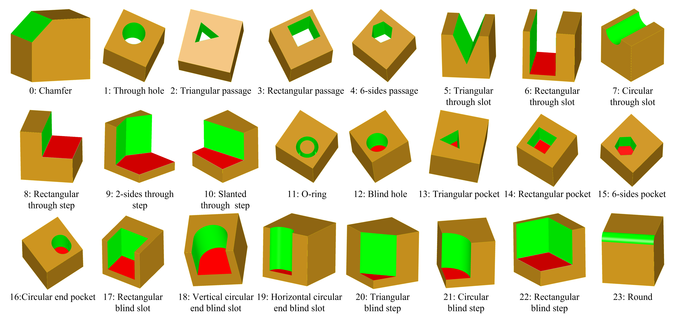
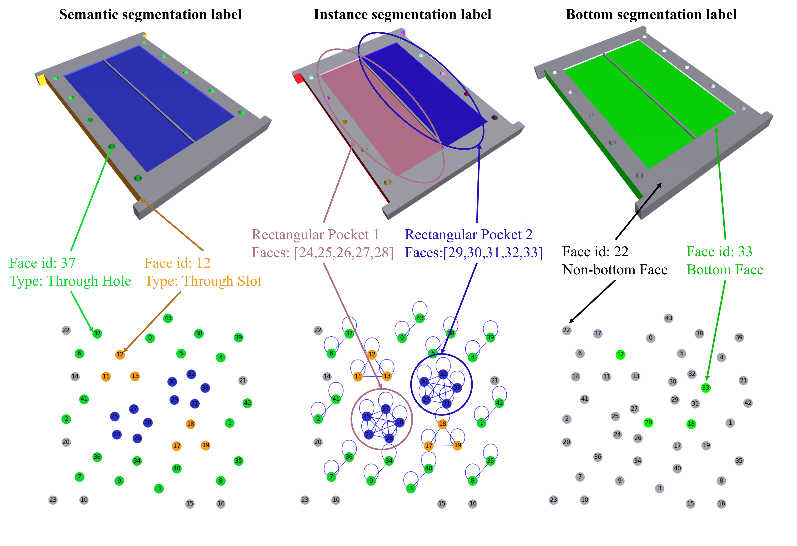
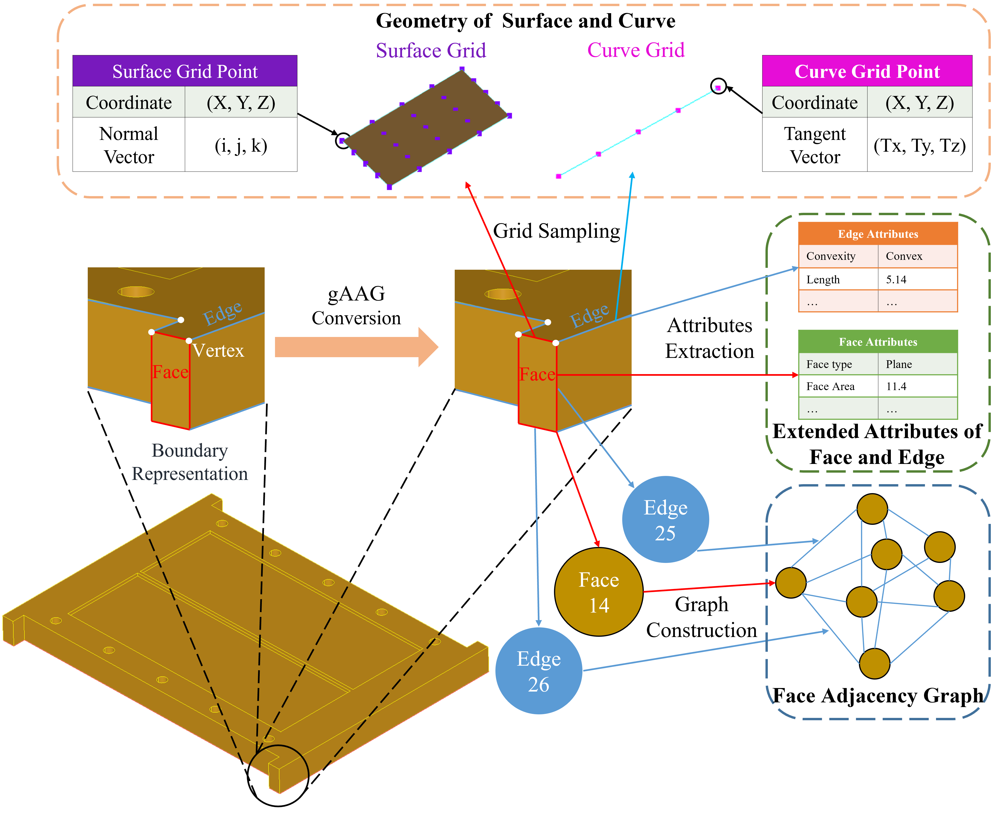

## Generate Synthetic Data
Make sure you have prepared required environment.
Enter 'dataset' folder 
```
cd dataset
```
and Open [main.py](main.py)
```
Line 193 dataset_dir = 'data' # output directory
Line 194 combo_range = [5, 14] # the number of features in a solid, format: [min num of features, max num of features]
Line 195 num_samples = 22000 # the number of generated STEP files. 
# The actual number of STEPs is usually less than this because some fail to generate.
Line 196 num_workers = 12 # the number of workers, if you want to use multiprocess, set > 1
```
And then
```
python main.py
```
Next we need to confirm whether the generated STEPs and labels are valid:
```
python crosscheck.py --dataset <your generated dataset path>
```


Machining features used in the MFInstSeg dataset. The green faces are the non-bottom feature faces, red faces are the bottom feature faces, and brown faces are the stock faces. 



The labels include semantic segmentation labels which are expressed in python dict form as follows: $\{F_i: C_{F_i}\}$ where the $F_i$ indicates the index of the face entity $i$ in the B-Rep and the $C_{F_i}$ indicates the class index of the face entity $F_i$. They also include instance segmentation labels, which are represented as 2D dense adjacency matrices, more details in our paper. And the bottom semantic segmentation labels, which are also expressed in python dict form as follows: $\{F_i: \text{0 or 1} \}$ if the $F_i$ is a bottom face, the label is set to 1.

## Generate geometric AAG representation
In the previous step, the generated folder includes STEPs and its instance segmentation labels. Now, we need to extract topology and geometry information from the STEP data feed to neural network.
```
python .\AAGExtractor.py --step_path <your STEP folder> --output <output directory> --num_workers <the number of workers>
```


A novel B-Rep descriptor called Geometric Attributed Adjacency Graph (gAAG) is proposed, which provides the flexibility to handle varying number of entities in B-Rep models and preserves their geometric, topological information and extended attributes.

## Data Partition
We has provided the MFInstSeg split file in the 'MFInstseg_partition' folder.
If you want to use you dataset, you also need to prepare your data split file and place them into the 'MFInstseg_partition' folder.
There 3 text files in the 'MFInstseg_partition' folder:
- train.txt
- val.txt
- test.txt

In each file, there are only 1 columns, which is the file name of STEP.
for example:
We have 5 STEP files in the test set, 
```
20221121_154648_19305.step
20221124_154714_15174.step
20221121_154648_22767.step
20221124_154714_823.step
20221123_142528_14230.step
```
So, the 'test.txt' file should be like this:
```
20221121_154648_19305
20221124_154714_15174
20221121_154648_22767
20221124_154714_823
20221123_142528_14230
```

## If you want to export data from MFCAD/MFCAD++
Delete the corrupt samples
```
python crosscheck_MFCADPP.py --dataset <your generated dataset path>
```

Extract labels from the STEP files of MFCAD/MFCAD++ and store them in JSON

Open the 
```
Line 63    shape_dir = "steps" # path to MFCAD/MFCAD++ dataset/steps
Line 64    graph_dir = "labels" # output dir for extracted labels
```

the run it
```
python extract_label_from_MFCADPP.py
```

convert STEPs to gAAG
```
python .\AAGExtractor.py --step_path <your STEP folder> --output <output directory> --num_workers <the number of workers>
```

## Reference
This dataset generation code is based on the following papers:
- [Hierarchical CADNet: Learning from B-Reps for Machining Feature Recognition](https://gitlab.com/qub_femg/machine-learning/hierarchical-cadnet)
- [Graph Representation of 3D CAD models for Machining Feature Recognition with Deep Learning](https://gitlab.com/qub_femg/machine-learning/cadnet)
